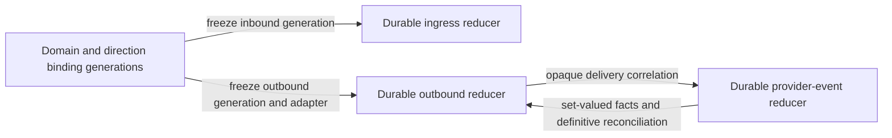

# Modular mail edge formal model

This directory contains a finite-state TLA+ specification of the provider-neutral
mail edge described in
[`ops/owned-provider/MAIL_EDGE_ARCHITECTURE.md`](../../ops/owned-provider/MAIL_EDGE_ARCHITECTURE.md).
It is a design model, not production code. TLC exhaustively checks every
reachable state inside the bounds below.

## Model shape

`MailEdge.tla` composes four independently scheduled state machines:



Every known domain starts with generation 1 active independently for inbound and
outbound. Cutover atomically makes the old generation `draining` and a new
generation `active`. Drain waits until that generation has no non-definitive
work before retiring it. Rollback atomically swaps the current active generation
with a draining predecessor. Unknown domains have no binding entry.

Ingress and outbound bytes start present. Each reducer uses `queued`, `leased`,
and definitive states, with bounded crash/lease-expiry recovery. Ingress
injection is atomic with `processed`. Outbound submission freezes its generation
and adapter before leasing. A definitive provider `retry` may return it to the
queue; SMTP DATA acknowledgement loss or a provider timeout after submission
sets `unknown`, which has no automated path back to submission. Operator
quarantine or correlated definitive feedback may resolve it.

Provider events are durably queued and leased. The reducer records the provider
event key before applying or quarantining the event. Event 3 can duplicate event
1 in the dedupe model. Events 1 and 2 are delayed and delivered facts for the
same delivery, and TLC explores both application orders. Facts accumulate in a
set so a late delayed event cannot undo a definitive result. Uncorrelated events
are quarantined.

## Contract-to-model mapping

| Neutral architecture contract or state | Model abstraction |
| --- | --- |
| Owned alias domain and direction-specific binding | `KnownDomains`, `Directions`, `bindingPhase[d][direction][g]` |
| Binding generation | `Generations`; phase is `inactive`, `active`, `draining`, or `retired` |
| Provider adapter selected by a generation | `AdapterFor(g)`; odd generations are `primary`, even generations are `fallback` |
| Durable public-MTA ingress queue | `ingressStatus`, `ingressLease`, `ingressBlobPresent` |
| Private handler injection | atomic `ProcessIngress`, recorded by `ingressInjectionCount` |
| Neutral submission record and durable outbound queue | one `Deliveries` member, `deliveryStatus`, `deliveryBlobPresent` |
| Frozen `edge_delivery_id` route | `frozenGeneration`, `frozenAdapter`; the item identity is the bounded delivery index |
| Provider submission attempt | `BeginSubmission`, `submitCount`, `submissionGeneration`, `submissionAdapter`, `adaptersUsed` |
| Adapter `accepted`, `retry`, and `reject` results | `SubmitAccepted`, `SubmitRetry`, `SubmitRejected` |
| Adapter `unknown` result | `MarkUnknown(..., "provider-submission-timeout")` |
| Accepted SMTP DATA with a lost acknowledgement | `MarkUnknown(..., "smtp-data-ack-lost")` |
| Provider-neutral feedback record | one `Events` member, `EventKey`, `EventDelivery`, `EventKind` |
| Durable feedback queue and dedupe | `eventStatus`, `eventLease`, `processedEventKeys`, `eventApplyCount` |
| Delayed or out-of-order feedback | independently scheduled events plus set-valued `deliveryFeedback` |
| Dead-letter handling | `QuarantineIngress`, `QuarantineDelivery`, or an event state of `quarantined` |
| Content retention/deletion | `ingressBlobPresent`, `deliveryBlobPresent`, and guarded delete actions |

Concrete envelope addresses, recipients, MIME bytes, and provider message IDs
are collapsed to stable item identities because the checked properties depend on
correlation, state, and route identity rather than their contents.

## Checked properties

Every safety configuration checks `TypeOK` plus these invariants without
configuration-specific weakening:

- `AmbiguousSendIsNeverResentOrRerouted`
- `ProviderEventAppliedAtMostOnce`
- `AtMostOneActiveGeneration`
- `SubmissionKeepsFrozenRoute`
- `ProcessedIngressIsNotReinjected`
- `UnknownDomainsHaveNoDefaultRoute`
- `QueuedBytesRetainedUntilDefinitiveDisposition`

The liveness configuration additionally checks:

- `KnownIngressEventuallyReduced`
- `NonAmbiguousRetryableDeliveryEventuallyDefinitive`

The liveness behavior uses weak fairness only for continuously enabled routing,
leasing, reducer, and adapter-result actions. It assumes durable workers continue
to be scheduled, no worker crashes in the checked liveness bound, ambiguity is
disabled, and the adapter returns at most `MaxRetries` definitive retry results
before accepting or rejecting. There is deliberately no fairness assumption for
ambiguous work: automatic progress there would encode the unsafe resend this
model forbids.

## Exhaustive bounds and results

These results were produced with one TLC worker and fingerprint polynomial 0.
`D/G/I/O/E` mean known domains, generations, ingress items, outbound deliveries,
and events. Generated states include duplicates; distinct states are the fully
explored reachable state graph.

| Configuration | Bounds and enabled failures | Generated states | Distinct states | Result |
| --- | ---: | ---: | ---: | --- |
| `core-safety` | D1/G2/I1/O1/E2, 1 crash, 1 retry, ambiguity | 22,263,568 | 4,255,965 | All 8 invariants pass |
| `binding-independence` | D2/G2/I1/O1/E1, ambiguity | 5,456,576 | 842,875 | All 8 invariants pass |
| `dedupe-ordering` | D1/G1/I1/O1/E3, 1 crash, duplicate and reordered events | 1,034,989 | 256,113 | All 8 invariants pass |
| `unknown-domain` | D1/G1/I2/O2/E1, one unknown ingress, delivery, and event | 16,465 | 4,032 | All 8 invariants pass |
| `liveness` | D1/G1/I1/O1/E2, 1 retry, no crash or ambiguity | 9,752 | 2,975 | 8 invariants and 2 liveness properties pass |
| **Total** | Five exhaustive configurations | **28,781,350** | **5,361,960** | No positive-model error |

TLC also checked two temporal branches over 5,950 liveness graph nodes. State
counts are reproducible for the pinned tools and single-worker command, but they
are evidence only for these finite bounds, not an unbounded mathematical proof.

## Counterexample regressions

`MailEdgeRegressions.tla` adds one intentionally bad action at a time. The
regression suite succeeds only when TLC exits nonzero and names the expected
unchanged invariant. This checks that each property is reachable and capable of
rejecting its corresponding implementation defect.

| Regression | Deliberate defect | Expected counterexample |
| --- | --- | --- |
| `ambiguous-resend` | resubmit `unknown` work through the other adapter | ambiguous send invariant |
| `duplicate-event` | apply a previously processed provider event key again | event at-most-once invariant |
| `dual-active-generation` | activate a new generation without draining the old | single-active-generation invariant |
| `reroute-submission` | resolve the current adapter after cutover instead of using the frozen route | frozen-route invariant |
| `reinject-processed` | inject a processed ingress item again | ingress reinjection invariant |
| `default-unknown-route` | assign generation 1 as a default for an unknown domain | no-default-route invariant |
| `early-blob-delete` | delete bytes while an outbound item is queued | retention invariant |

## Reproducible commands

The runner downloads the official TLA+ Tools 1.7.3 release and verifies
`tla2tools.jar` with SHA-256
`ae7a33bbe99e5a3783c28d826d20e0028fc87f5a8cc8f9520afab00eabbc0bb1`.
It runs TLC 2.18 on Eclipse Temurin Java `21.0.8+9`, pinned by the multi-platform
image digest
`sha256:db1689535962d757a5adabf57387584ed543d38c0b9d1fe870123ea362ad73b0`.
The jar is cached outside the repository. No provider credentials or network
mail traffic are involved.

```sh
make -C formal/mail-edge check
make -C formal/mail-edge regressions
make -C formal/mail-edge ci
```

Set `TLC_RUNTIME=docker` to require the pinned container, as CI does. Set it to
`host` only when deliberately using a local Java 11 or newer runtime; the TLC jar
remains pinned and verified.

## Outside this proof

The model does not prove unbounded executions or implementation refinement. It
does not model SMTP wire semantics, MIME fidelity, queue encryption or capacity,
disk and database atomicity, real clock/lease durations, multi-recipient partial
success, cryptographic event authentication, provider API correctness,
provider-side dedupe, DNS, DKIM/DMARC/ARC, VERP/DSN loop prevention, credential
scope, observability, suppression policy, legal retention, provider content
deletion, or operator correctness during manual reconciliation. Byzantine
workers, corrupt storage, an adapter falsely reporting a definitive result, and
conflicting definitive provider events are also outside the proof.

Production readiness still requires the observable staging gates in the
architecture record and a refinement review showing that implementation
transactions preserve these modeled state transitions and guards.
