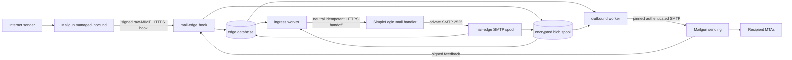

# Provider-neutral modular mail edge

Status: implemented software boundary; not deployed or activated

Decision date: 2026-08-13

Implementation package: [`../../mail-edge`](../../mail-edge)

## Superseded decision

This record replaces the earlier decision on this branch that selected a
self-owned inbound MTA and Amazon SES as the initial outbound adapter. That
topology is obsolete. The selected design is Mailgun-first managed inbound and
Mailgun-first managed outbound behind an independently deployable,
provider-neutral mail edge.

This decision and its implementation do not authorize provider configuration,
DNS changes, production traffic, credential creation, domain activation, or a
claim that Mailgun is qualified. Personal domains, personal-account migration,
branding, and provider-specific product behavior remain outside scope.

## Decision

Deploy `simplelogin-mail-edge` independently from the SimpleLogin application.
Use Mailgun as the first adapter to qualify for both directions:

- managed inbound MX terminates at Mailgun and an exact-domain route sends its
  raw-MIME HTTPS hook to a generation-specific edge endpoint;
- outbound SimpleLogin mail enters the edge through a private SMTP spool on port
  2525 and is submitted by the Mailgun adapter over authenticated STARTTLS SMTP.

The edge is the durability and provider-normalization boundary. SimpleLogin
continues to own users, aliases, mailboxes, contacts, reverse aliases, VERP
semantics, authorization, and message transformation. The edge owns only:

- encrypted raw MIME and envelope bytes while durable handoff is incomplete;
- exact-domain inbound and outbound route generations;
- provider capability declarations and product qualification evidence;
- submission and feedback correlation;
- retry leases, quarantine, reconciliation, hashes, sizes, and bounded redacted
  operational metadata.

The edge never imports `app`, `email_handler`, or a SimpleLogin model. It has its
own Python distribution, database credential, migrations, encrypted blob keys,
provider credentials, release artifact, and independently supervised processes.



No diagram edge is a fallback. A provider change creates a new route generation;
it does not copy or reinterpret SimpleLogin-owned state.

## Independent package and processes

`mail-edge/pyproject.toml` builds the `simplelogin-mail-edge` wheel and source
distribution without the root application package. The installed entry points
are:

| Process | Responsibility |
| --- | --- |
| `mail-edge-hook` | TLS-only Mailgun inbound and feedback hooks; authenticity, replay, normalization, and durable commit |
| `mail-edge-smtp` | Private SMTP spool on port 2525; exact-domain lookup, MIME validation, encrypted durable commit, and post-commit `250` |
| `mail-edge-worker --kind ingress` | Idempotent raw-MIME/envelope handoff to the product-owned neutral HTTPS endpoint |
| `mail-edge-worker --kind outbound` | Generation-pinned provider submission and outcome reduction |
| `mail-edge-worker --kind retention` | Safe terminal-content deletion; no deletion of unknown or open-quarantine content |
| `mail-edge-metrics` | Loopback/private liveness, migration-aware readiness, and bounded-cardinality metrics |
| `mail-edge` | Migrations, capability evidence, route lifecycle, quarantine, and reconciliation CLI |

PostgreSQL is the production database. SQLite exists for contained tests only.
The packaged migrations create only edge-owned tables. Database triggers prevent
changes to a route generation's domain, direction, generation number, provider,
provider configuration, or policy version after creation; only its lifecycle
state can change.

Raw MIME and envelopes use a separate durable local blob volume. AES-GCM keys
never enter the edge database. Writes use a no-clobber temporary file, file
`fsync`, atomic link, and directory `fsync` before the database commit can lead
to an SMTP `250` or hook HTTP 200.

## Neutral contracts

Provider-native request fields exist only inside an adapter. The durable and
handoff contracts contain these neutral concepts:

| Contract | Required identity and content |
| --- | --- |
| Inbound notice | UUIDv7 notice ID, provider/event identity, exact domain, binding generation, SMTP envelope, occurrence time, raw-availability flag, bounded diagnostics |
| Inbound raw message | UUIDv7 message and notice IDs, exact domain and generation, SMTP envelope, unmodified bytes, byte length, SHA-256 |
| Outbound submission | Caller-issued UUIDv7 submission ID, exact domain and generation, SMTP envelope, unmodified bytes, byte length, SHA-256 |
| Outbound result | Submission ID, accepted/rejected/temporary-failure/unknown outcome, optional receipt, occurrence time, bounded code, retry delay only for definitely unsubmitted work |
| Feedback | UUIDv7 feedback ID, provider event identity, neutral event kind, occurrence time, hashed recipient, optional submission/receipt correlation, bounded code |

The SimpleLogin-to-edge SMTP contract requires one
`X-Mail-Edge-Submission-ID` UUIDv7 header. A replay after a lost SMTP
acknowledgement reuses that ID and the identical envelope and bytes. The edge
returns `250` for the existing durable record and never creates a second
submission. Reuse with different bytes, route, or envelope is a conflict.

Inbound handoff uses `PUT` with the raw MIME as `message/rfc822`, an
`Idempotency-Key` equal to the edge message ID, and neutral `Mail-Edge-*`
headers carrying the domain, pinned generation, hash, notice ID, and base64url
envelope JSON. A 2xx or conflict response proves the idempotent downstream
record exists. Cleartext handoff URLs are refused.

## Exact-domain immutable bindings

Inbound and outbound route namespaces are independent. A binding is keyed by
the normalized exact domain, direction, and monotonically increasing generation.
Wildcard, suffix, parent-domain, and default-provider lookup are forbidden.
Unknown outbound envelope domains receive SMTP `550 5.1.8`; unknown hook paths
or envelope domains receive a non-applicable response and never fall through.

Each generation follows this lifecycle:

```text
prepared -> shadow -> active -> draining -> disabled
         \-> disabled
```

- `prepared` records immutable non-secret provider configuration.
- `shadow` permits qualification without normal traffic activation.
- `active` is the only state selected for new work.
- `draining` accepts only retries or feedback already pinned to that generation.
- `disabled` is terminal and requires no nonterminal pinned work.

`mail-edge binding switch` changes an old active generation to draining and a
qualified shadow generation to active in one database transaction. It never
changes the binding ID on a committed message. Inbound and outbound may switch
at different times and may use different providers in future adapters.

## Capability policy and activation evidence

An installed adapter declares only what it implements. Declaration, provider
availability, an account setting, or provider GA status never qualifies a
domain. The product policy separately requires current, passing, reviewed,
artifact-backed evidence.

The first policy requires, as applicable to each direction:

- exact-domain routing and domain DNS control;
- managed inbound, raw-MIME ingress, envelope fidelity, and the inbound retry
  window;
- prebuilt/raw MIME submission with exact envelope control;
- HMAC authentication, timestamp bounds, dedupe, and replay resistance;
- unknown-outcome safety with no automatic resend or cross-provider failover;
- feedback completeness and correlation;
- recipient-observed MIME fidelity;
- safe provider and local retention;
- dedicated account/subaccount and credential isolation.

Most evidence is scoped to the exact domain. Account-isolation evidence is
scoped to `*`. Evidence includes a SHA-256 artifact digest, durable evidence URI,
reviewer, observation time, expiry, policy version, and pass/fail result.
Activation fails closed if any required item is missing, failed, expired, scoped
elsewhere, or unsupported.

## Mailgun-first adapter

For inbound, configure an exact-domain Mailgun Route or Forward to the
generation-specific HTTPS URL ending in `/raw-mime`. Mailgun documents that this
suffix supplies `body-mime` rather than parsed body parts. The adapter verifies
the Mailgun HMAC over timestamp and token, enforces a bounded time window,
deduplicates the token, verifies the recipient's exact domain, and preserves the
decoded `body-mime` bytes. The hook returns success only after encrypted blob and
database durability. Mailgun documents retrying non-200/non-406 route POSTs over
an approximately eight-hour schedule; the local queue must not rely on that
window as its only recovery path.

For outbound, the adapter deliberately uses Mailgun SMTP rather than its
`messages.mime` HTTP endpoint. The documented MIME endpoint accepts recipients
and the MIME file but does not expose an independent SMTP envelope sender.
Authenticated Mailgun SMTP lets the edge preserve the SimpleLogin-supplied
`MAIL FROM`, including VERP local parts. The adapter requires STARTTLS and inserts
Mailgun correlation control headers only in its provider wire copy, with
`X-Mailgun-Suppress-Headers: all`; the neutral submission and encrypted source
blob remain byte-for-byte unchanged. Recipient fixtures must prove the control
headers are absent and the allowed transport-header diff is satisfied before
activation.

Current official behavior used by the adapter is documented in Mailgun's
[raw-MIME inbound hook](https://documentation.mailgun.com/docs/mailgun/user-manual/receive-forward-store/receive-http),
[route actions and retry behavior](https://documentation.mailgun.com/docs/mailgun/user-manual/receive-forward-store/route-actions),
[webhook authentication](https://documentation.mailgun.com/docs/mailgun/user-manual/webhooks/securing-webhooks),
[SMTP sending options](https://documentation.mailgun.com/docs/mailgun/user-manual/sending-messages/send-smtp),
and [webhook payloads](https://documentation.mailgun.com/docs/mailgun/user-manual/webhooks/webhook-payloads).
These links describe provider capability, not qualification evidence.

## Reducers, retry, and unknown outcomes

Ingress notices and raw messages may arrive in either order. Their reducer moves
`empty` through `notice_only` or `raw_only` to `ready`; duplicates are no-ops only
when hashes, envelope, domain, provider event, and generation agree. An ingress
handoff lease can be retried because the downstream key is idempotent.

Outbound work moves through `queued`, `submitting`, and either a definitive
terminal state or `retry_wait`. Exponential backoff has deterministic bounded
jitter and a finite attempt count. Only failures known to have happened before
provider submission can enter `retry_wait`.

A timeout, disconnect, crash, or lost response while waiting for the provider's
post-DATA result is ambiguous. It becomes `unknown`, creates an open quarantine
record, clears all retry scheduling, and remains pinned to its original provider
generation. An expired `submitting` lease follows the same rule because a
restarted worker cannot know whether the provider accepted the message. Unknown
work is never automatically resent and never crosses to another provider.

Authenticated correlated feedback may resolve an unknown submission. Otherwise
an operator must use `mail-edge unknown resolve` with bounded evidence and an
accepted or rejected conclusion. Uncorrelated or conflicting feedback is stored
once in quarantine and has no SimpleLogin state effect.

## Fidelity, diagnostics, and retention

The raw source bytes and SMTP envelope are separately encrypted and hashed.
Parsing is limited to validation and bounded header correlation; the source
message is never regenerated. SMTP rejects missing header/body boundaries, NUL
in the header framing path, invalid or duplicate submission IDs, non-CRLF DATA,
oversized header blocks, too many recipients, and messages over the configured
limit. It never truncates, repairs, recompresses, or drops MIME parts.

Diagnostics have fixed field and byte limits. Known secrets are replaced,
addresses and IPs are salted hashes, long token-like values are removed, and
newlines are collapsed. Provider request bodies, cleartext addresses, subjects,
message bodies, and credentials are not logged or stored as diagnostic JSON.

The retention worker deletes content only after a definitive inbound handoff or
definitive outbound accepted/rejected result and the configured expiry. It
unlinks both encrypted envelope and MIME blobs durably before marking the row
deleted. Unknown and open-quarantine content is never automatically deleted.
An encrypted file left by a crash before database commit is eligible for orphan
cleanup only when no database row references it and a seven-day grace period has
elapsed. Filesystem secure overwrite is not claimed; cryptographic erasure
requires retiring an isolated blob key only after every referenced blob under
that key is expired and verified absent.

## Staged activation

Activation is an operator-controlled sequence per exact domain and direction:

1. Build and verify reproducible package artifacts from `mail-edge/`.
2. Provision an edge-only PostgreSQL database, blob volume, key ring, diagnostic
   salt, handoff credential, TLS certificate, and domain-scoped provider
   credential outside this repository.
3. Apply edge migrations and start hook, SMTP, worker, retention, and metrics
   processes on private service networks. Keep SimpleLogin's application SMTP
   listener unreachable from the provider and public Internet.
4. Create separate prepared inbound and outbound generations with only a
   credential reference and provider endpoint configuration, then move them to
   shadow.
5. In isolated staging, collect exact-domain policy evidence for signatures,
   replay, duplicate/out-of-order notices, raw MIME/envelope fidelity, provider
   feedback, pre/post-DATA faults, unknown reconciliation, retention, DNS,
   privacy, quota, and account isolation.
6. Record the reviewed artifacts. Confirm the registry reports no missing or
   expired requirement.
7. Activate inbound and outbound independently. Change authoritative DNS only
   through the separately approved DNS change process; this repository does not
   perform it.
8. Observe queue age, provider feedback lag, unknown count, quarantine, storage,
   and controlled end-to-end mail before draining and disabling the previous
   generation.

Rollback is another explicit generation switch. It is allowed only for new,
definitively unsubmitted work. Unknown attempts remain with the generation that
may already have sent them.

## Non-goals

This package does not provision Mailgun accounts, routes, domains, DNS, TLS
certificates, or credentials. It does not deploy itself, migrate aliases or
personal accounts, add product branding, choose a personal domain, or infer
provider qualification from marketing status. New providers require a real
adapter, the same neutral contract suite, and current product-policy evidence;
production placeholder adapters are not accepted.
