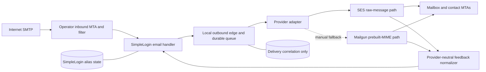

# Mail-edge architecture decision

Status: neutral core bridge implemented; provider qualification remains pending

Decision date: 2026-08-13

Repository base: `origin/feat/owned-provider-production` at
`fd6f63c1a02b153cf65ed905b34e50d2f516e1d3`

Implementation branch: `feat/mail-edge-core-bridge`

This decision and its neutral core implementation do not authorize deployment,
DNS changes, provider configuration, production traffic, or a claim of
production readiness. Personal domains, alias-state migration, recovery logic,
and product branding are outside scope.

## Decision

Keep inbound SMTP directly under operator control. Put a durable,
provider-neutral outbound edge between SimpleLogin and any managed sender. Use
Amazon SES through a raw-message API adapter as the first provider to qualify,
with Mailgun's prebuilt-MIME path as the manually activated fallback to qualify.
Do not use automatic cross-provider failover.

Neither provider is approved by this record. Both must pass the acceptance gates
below. In particular, SES is documented to replace `Date`, `Message-ID`, and the
recipient-visible `Return-Path`. If delivery-thread correlation, MIME-part hashes,
arbitrary alias identities, or feedback correlation fail, SES is rejected. If
Mailgun changes the same observable properties or cannot retain the requested
envelope correlation, it is rejected too. Exact preservation of the original
on-wire SMTP `MAIL FROM` would rule out SES and currently leaves no verified
managed provider in this comparison; the remaining topology is a separately
qualified self-operated outbound MTA.

Cloudflare Email Routing is not the inbound edge in this decision. Moving MX to
it would replace direct inbound SMTP, and forwarding from an Email Worker is to
verified destinations unless a new HTTP ingestion path is built. Cloudflare
Email Sending, Resend, and Postmark remain non-selected alternatives for the
reasons below.



The outbound edge may retain queued message bytes and a delivery correlation
record. It must not own or replicate aliases, contacts, mailboxes, reverse-alias
rules, or user state. That boundary keeps a provider change from becoming an
alias-state migration.

## Existing mail path audit

The findings below are from the recorded base, not from a running deployment.
`V` means verified in source, `P` means present but incomplete for a public edge,
and `N` means not implemented in this overlay.

| Capability | State | Evidence and consequence |
| --- | --- | --- |
| Direct inbound SMTP | P | The production example publishes port 25 on all interfaces ([config.production.env.example](config.production.env.example#L6-L7)), and Compose exposes the application listener ([compose.yml](compose.yml#L254-L264)). The listener is a bare `aiosmtpd.Controller` that parses `envelope.original_content`; it configures a size limit but no TLS, authentication, recipient-time validation, connection policy, or abuse controls ([email_handler.py](../../email_handler.py#L2380-L2384), [email_handler.py](../../email_handler.py#L2477-L2486)). It is an internal application SMTP endpoint, not a hardened Internet MTA. |
| External outbound relay | P | The overlay points `POSTFIX_SERVER` and port at an operator-supplied relay ([compose.yml](compose.yml#L38-L44)). The sender passes an explicit envelope and serialized RFC 822 message to `SMTP.sendmail`, with optional STARTTLS ([mail_sender.py](../../app/mail_sender.py#L188-L227)). It has no SMTP AUTH or implicit TLS, so current code cannot connect directly to every shortlisted provider. |
| Envelope and header rewriting | V | Forwarding rewrites `From`, `Reply-To`, `To`, and `Cc`, then sends from a signed per-message VERP address ([email_handler.py](../../email_handler.py#L921-L956), [email_handler.py](../../email_handler.py#L966-L976)). Reply processing retains only selected threading and MIME headers, rewrites `From` to the alias and recipients to contacts, and uses a reply-phase VERP ([email_handler.py](../../email_handler.py#L1195-L1211), [email_handler.py](../../email_handler.py#L1271-L1335)). |
| Reverse-alias replies | V | Replies are authorized against the mailbox and reverse alias, rewritten to the contact, and tracked with `MessageIDMatching` ([email_handler.py](../../email_handler.py#L1408-L1455)). A provider that changes `Message-ID` can disrupt this unless the edge records and translates the provider-assigned ID. |
| Bounces | V | HMAC-signed VERP encodes phase and object ID ([email_utils.py](../../app/email_utils.py#L1665-L1691)). Incoming null-sender `multipart/report` DSNs are recognized and applied to forward, reply, and transactional records ([email_handler.py](../../email_handler.py#L1910-L1951), [email_handler.py](../../email_handler.py#L2137-L2182)). |
| Complaints | P | The handler recognizes only Hotmail and Yahoo complaint senders at `POSTMASTER` ([email_handler.py](../../email_handler.py#L2206-L2227)); the parser has provider-specific ARF layouts ([provider_complaint.py](../../app/handler/provider_complaint.py#L155-L200)). There is no generic managed-provider event consumer. |
| Raw MIME fidelity | P | Inbound bytes are parsed, transformed, and regenerated. `message_to_bytes` tries Python email policies and can refold/re-encode content ([message_utils.py](../../app/message_utils.py#L12-L30)); base64 text parts can be rewrapped ([message_utils.py](../../app/message_utils.py#L33-L46)). The valid gate is semantic MIME fidelity, not byte equality. |
| DKIM | P | The application signs after forward/reply transformation. Its preferred signature includes `Message-ID` and `Date` ([headers.py](../../app/email/headers.py#L28-L34)), which SES documents that it replaces. `RSPAMD_SIGN_DKIM` can defer signing to an edge, but the overlay does not configure such an edge ([email_utils.py](../../app/email_utils.py#L518-L527)). |
| SPF and DMARC | P | The application can consume upstream spam-filter SPF/DMARC results, but the overlay does not configure a trusted filter or enable the relevant production flags. The DNS preflight assumes a direct outbound IP, local DKIM key, and strict DMARC record ([MAIL_DNS.md](MAIL_DNS.md#L6-L14)); it does not understand a managed sender's SPF include, custom MAIL FROM, or selectors. |
| ARC | N | No ARC validation or sealing exists in the application or owned-provider overlay. Any inbound ARC chain may be invalidated by message transformation. An outbound edge may seal only after trusted inbound authentication results are established and provider mutation is qualified. |
| SRS | N | No SRS implementation exists. SimpleLogin instead replaces the outbound envelope sender with its own signed VERP. SRS is unnecessary on this selected application path, but would be required for any transparent forwarding path that preserves an external envelope domain. |

The production audit already states that a production MTA, authenticated relay,
durable queue, feedback monitoring, reputation controls, TLS, and staged tests
remain external requirements ([PRODUCTION_AUDIT.md](PRODUCTION_AUDIT.md#L24-L47)).
The current synthetic probe checks only `EHLO` against ingress and relay; it does
not submit or observe mail ([synthetic_probe.py](scripts/synthetic_probe.py#L93-L107)).

## Hard interpretation of fidelity and envelope control

End-to-end byte equality is not a valid gate because transport headers are added
and the application itself regenerates MIME. Qualification therefore permits only
a documented allowlist of transport changes: `Received`, provider trace headers,
the provider DKIM signature, and, when explicitly accepted, `Date`, `Message-ID`,
and `Return-Path`. The MIME tree, decoded body bytes, attachment hashes,
Content-ID relationships, PGP/MIME or S/MIME parts, visible `From`, `Reply-To`,
`To`, `Cc`, `Subject`, and SimpleLogin correlation headers must remain equivalent.

Envelope control means all of the following:

1. SimpleLogin supplies the original HMAC-signed VERP and recipient to the edge.
2. The edge records the original VERP before provider submission.
3. Each provider acceptance is correlated to exactly one edge delivery ID.
4. Every hard bounce, soft bounce, complaint, rejection, and delivery delay can be
   mapped back to that delivery and phase without using alias state at the
   provider.
5. The edge never silently substitutes a sender domain or collapses multiple
   aliases into a branded identity.

SES can meet this functional definition using its accepted-message ID and event
mapping even though it changes the recipient-visible return path. That is a
documented compromise, not exact on-wire envelope preservation.

## Provider evidence and evaluation

Provider documentation was checked on 2026-08-13. `V` is documented, `I` is an
inference that requires a controlled test, `U` is not established in the cited
documentation, and `F` conflicts with a hard requirement as currently
documented. Prices exclude taxes, support, storage, queueing, and surrounding
compute.

| Provider | MIME, identity, and envelope | Feedback and privacy | Limits, cost, and decision |
| --- | --- | --- | --- |
| Amazon SES | V: raw MIME through API or SMTP, verified domain identities cover addresses under that domain, and raw sends accept explicit source/destination. F for exact fidelity: SES replaces `Date`, `Message-ID`, and recipient-visible `Return-Path`. I: semantic MIME and reverse-thread behavior pass with edge correlation. | V: bounce, complaint, delay, delivery, reject, and send events can go through SNS; AWS explicitly recommends storing the SES message-ID mapping because it does not retain custom IDs. U: no public message-content retention duration was found; legal/DPA review is a gate. Account or regional sending can be paused. | V: 40 MB through v2/SMTP, 50 recipients, 10,000 identities per region, and region/account-specific recipient rate and daily quotas; sandbox starts at 200/day and 1/s. Sending is $0.10/1,000 plus data. **Conditional primary** because it clears size, domain identity, raw input, event, maturity, and cost gates, subject to the mutation tests. |
| Mailgun | V: prebuilt MIME endpoint and SMTP, 25 MB documented maximum, sending domain identity. I: arbitrary alias local parts and semantic MIME work. U: preservation or recoverability of the submitted per-message envelope local part must be tested. | V: signed event webhooks cover accepted, delivered, temporary/permanent failure, and complaints. F for data minimization unless contract/config is accepted: the tracking guide says paid event data lasts at least 30 days and suppression-related messages are stored permanently, while the pricing page advertises shorter plan log/message windows. Treat the longer period as applicable until Mailgun resolves that conflict in writing. Subaccounts can reduce blast radius. | U: effective sending throughput is reputation/account dependent. Current list prices start at $15 for 10,000 with one domain and $35 for 50,000 with up to 1,000 domains. **Conditional manual fallback**, primarily for 25 MB prebuilt MIME and a mature event model. |
| Cloudflare Email Sending | V: raw API accepts MIME plus envelope sender/recipients; authenticated SMTP uses implicit TLS and is beta. I: arbitrary local parts on an onboarded domain and message/thread preservation. F for the current 25 MiB product limit: arbitrary-recipient mail is limited to 5 MiB. | V: events include bounce, complaint, defer, fail, reject, and deliver through Queue subscriptions. V: activity logs last up to 30 days; message preview retains content about 7 days and can be disabled. Account-wide suppressions and an opaque initial daily limit increase suspension/quota blast radius. | V: 50 recipients and 30 Email Sending/Routing domains per zone; Workers Paid is required for arbitrary recipients, includes 3,000 messages/month, then $0.35/1,000. **Not selected** while the 5 MiB limit and young SMTP/event surfaces conflict with the existing limit and operational maturity gate. |
| Cloudflare Email Routing | V: Cloudflare receives MX traffic, Email Workers expose the raw message, and forwarding adds ARC and SRS. F for this topology: forwarding is to verified destinations, or a new Worker-to-HTTP ingestion path is required; Cloudflare becomes the inbound control plane. | V: 25 MiB inbound limit, 200 routing rules per domain and 200 verified destination addresses per account. Catch-all/Worker designs avoid one rule per alias but add a provider-specific ingress application. | **Credible inbound alternative, not direct inbound.** It increases MX/provider suspension blast radius and changes the existing SMTP trust boundary, so it is not the fallback for this decision. |
| Resend | V: authenticated SMTP accepts a composed message for a verified domain; a verified domain supports sender addresses on that exact domain. U: no documented raw-MIME HTTP endpoint, exact envelope preservation, or provider mutation contract was found. | V: signed, at-least-once, unordered bounce and complaint webhooks. F for default privacy posture: email data is retained for 30 days; disabling content storage is a paid add-on gated by account age and sending history. Team-level pauses apply at documented bounce/complaint thresholds. | V: 10 requests/s per team; free 100/day and 3,000/month, Pro currently $20 for 50,000 and 10 domains, and Scale $90 for 100,000 and 1,000 domains. **Not selected** until raw/envelope behavior and a minimally retained content mode are available and qualified. |
| Postmark | V: SMTP accepts custom MIME and verified domains support dynamic senders. F: 10 MB maximum is below the current limit; custom return path uses a fixed provider local part rather than SimpleLogin's per-message VERP. | V: bounce and spam-complaint webhooks. F: webhooks have no HMAC signature, and message content/activity is retained for 45 days by default with a documented minimum 7-day setting rather than immediate disablement. | V: unlimited daily sending is advertised; current 10,000-message plans are $15 with 5 domains, $16.50 with 10, or $18 with unlimited domains. **Not selected** because size, feedback authentication, return-path control, and retention conflict with hard gates. |

Operationally, the provider-neutral edge contains but does not remove vendor
coupling:

| Provider | Suspension blast radius | Portability and operational burden |
| --- | --- | --- |
| Amazon SES | Dedicated AWS account and one region; account/region quota review or pause stops outbound but not inbound. | Highest selected-provider burden: IAM, raw API adapter, region-specific identities, quota management, SNS/SQS feedback, and message-ID correlation. The coupling stays in one adapter and it has the lowest documented unit price. |
| Mailgun | Prefer a dedicated subaccount, domain, and key; parent policy or shared reputation can still affect it. | Medium burden: prebuilt-MIME adapter, signed webhook, region choice, and conflicting retention terms. Replacing the adapter does not move alias state. |
| Cloudflare | Email limits and suppressions are account-scoped; Routing would also put inbound MX in the same provider account. | High coupling if Routing is used: Cloudflare DNS, Email Workers, Queues, and MX. Sending-only coupling is smaller, but the 5 MiB gate already rejects it. |
| Resend | Documented quotas and pauses operate at team level. | Low-to-medium SMTP integration burden, but webhook normalization, default retention, and unverified envelope behavior remain. |
| Postmark | A server isolates configuration, but account review and provider reputation remain shared concerns. | Low SMTP integration burden and medium feedback burden; hard size, retention, webhook-authentication, and return-path failures dominate. |

### Credible non-selected topology

A self-operated outbound MTA is the only credible way to require the exact
SimpleLogin VERP as the on-wire SMTP envelope sender. It also gives the operator
the strongest control over raw MIME, logs, retention, and provider portability.
It imposes the largest operational burden: public IP and PTR lifecycle, DKIM and
TLS key management, queue durability, destination-specific throttling,
deliverability reputation, blocklist response, abuse handling, complaint feedback
loops, and around-the-clock monitoring. The existing DNS preflight is shaped for
this topology, but the overlay supplies none of those MTA controls. It is a
separate qualification path, not a ready hot standby.

### Authoritative provider sources

- Amazon SES: [raw email and MIME](https://docs.aws.amazon.com/ses/latest/dg/send-email-raw.html),
  [v2 raw request and feedback address](https://docs.aws.amazon.com/ses/latest/APIReference-V2/API_SendEmail.html),
  [header mutation](https://docs.aws.amazon.com/ses/latest/dg/header-fields.html),
  [domain identities and VERP](https://docs.aws.amazon.com/ses/latest/dg/creating-identities.html),
  [notification correlation](https://docs.aws.amazon.com/ses/latest/dg/troubleshoot-notifications.html),
  [event fields](https://docs.aws.amazon.com/ses/latest/dg/event-publishing-retrieving-sns-contents.html),
  [quotas](https://docs.aws.amazon.com/ses/latest/dg/quotas.html),
  [enforcement](https://docs.aws.amazon.com/ses/latest/dg/faqs-enforcement.html), and
  [pricing](https://aws.amazon.com/ses/pricing/).
- Mailgun: [prebuilt MIME and message limits](https://documentation.mailgun.com/docs/mailgun/user-manual/sending-messages/send-http),
  [MIME API](https://documentation.mailgun.com/docs/mailgun/api-reference/send/mailgun/messages/post-v3--domain-name--messages),
  [sender domains](https://documentation.mailgun.com/docs/mailgun/faq/sending),
  [webhooks](https://documentation.mailgun.com/docs/mailgun/user-manual/webhooks/webhooks),
  [tracking and retention](https://documentation.mailgun.com/docs/mailgun/user-manual/tracking-messages/tracking-messages),
  [rate limits](https://documentation.mailgun.com/docs/mailgun/api-reference/send/mailgun/metrics/rate-limits-and-quotas), and
  [pricing](https://www.mailgun.com/pricing/).
- Cloudflare: [raw sending API](https://developers.cloudflare.com/api/resources/email_sending/methods/send_raw/),
  [SMTP submission](https://developers.cloudflare.com/email-service/api/send-emails/smtp/),
  [sending and routing limits](https://developers.cloudflare.com/email-service/platform/limits/),
  [event subscriptions](https://developers.cloudflare.com/email-service/platform/event-subscriptions/),
  [logs and preview](https://developers.cloudflare.com/email-service/observability/logs/),
  [pricing](https://developers.cloudflare.com/email-service/platform/pricing/),
  [Email Worker interface](https://developers.cloudflare.com/email-service/api/route-emails/email-handler/), and
  [routing lifecycle, ARC, and SRS](https://developers.cloudflare.com/email-service/concepts/email-lifecycle/).
- Resend: [SMTP](https://resend.com/docs/send-with-smtp),
  [domain identity](https://resend.com/docs/knowledge-base/403-error-domain-mismatch),
  [webhook delivery](https://resend.com/docs/webhooks/introduction),
  [bounce](https://resend.com/docs/webhooks/emails/bounced),
  [complaint](https://resend.com/docs/webhooks/emails/complained),
  [retention and content storage](https://resend.com/docs/knowledge-base/how-do-i-ensure-sensitive-data-isnt-stored-on-resend),
  [quotas](https://resend.com/docs/knowledge-base/account-quotas-and-limits), and
  [pricing](https://resend.com/pricing).
- Postmark: [SMTP](https://postmarkapp.com/developer/user-guide/send-email-with-smtp),
  [domain signatures](https://postmarkapp.com/developer/user-guide/managing-your-account/managing-sender-signatures),
  [custom return path](https://postmarkapp.com/support/article/910-how-do-i-add-a-custom-return-path),
  [message limits](https://postmarkapp.com/developer/api/overview),
  [webhook security](https://postmarkapp.com/developer/webhooks/webhooks-overview),
  [content retention](https://postmarkapp.com/support/article/can-i-hide-or-turn-off-saving-of-message-content-in-my-activity-page), and
  [pricing](https://postmarkapp.com/pricing).

## Provider-neutral boundary

The boundary is an internal SMTP service plus a provider adapter. SimpleLogin
continues to submit to `POSTFIX_SERVER`; the service must be reachable only on the
private runtime network and must never be an open relay.

The neutral submission record is:

```text
edge_delivery_id
envelope_from
envelope_recipients[]
rfc822_bytes
smtp_utf8_required
mail_options[]
rcpt_options[]
created_at
```

An adapter returns `accepted`, `retry`, `reject`, or `unknown`, plus the provider
message ID when accepted. The edge stores only the provider-message-ID mapping,
opaque edge ID, original VERP, recipient, submitted and provider-visible RFC 5322
message IDs, attempt state, and bounded diagnostics. Full message bytes remain
only in the encrypted durable queue until definitive acceptance or terminal
quarantine. An ambiguous timeout after submission is `unknown`, never an
automatic resend through the fallback.

The neutral feedback record is:

```text
provider_event_id
provider_message_id
edge_delivery_id
event_type: delivered | delayed | soft_bounce | hard_bounce | complaint | rejected
recipient
smtp_status
diagnostic
occurred_at
```

Events are authenticated, deduplicated by provider event ID, accepted out of
order, and correlated using an opaque edge tag when supported or the accepted
provider message ID otherwise. A bounce adapter may re-inject an RFC 3464 DSN
with null envelope sender to the stored original VERP, which the current handler
already understands. The private neutral feedback service now applies hard
bounces and complaints without accepting provider-native event bodies. Existing
direct DSN and Hotmail/Yahoo complaint paths remain unchanged.

## Exact integration and configuration surfaces

The receipt, correlation, feedback, and private-network pieces below are now
implemented on the SimpleLogin side. Provider adapters, public MTA policy, and
provider qualification remain outside this repository.

1. **Inbound DNS and MTA:** keep alias-domain MX on operator-controlled hosts.
   Terminate public SMTP, STARTTLS, connection limits, recipient validation,
   greylisting/reputation policy, and durable ingress queue at the MTA. Relay only
   accepted mail to the private `email:20381` application service.
2. **Inbound trust and threading:** strip headers that claim the local
   authentication service ID, plus untrusted local Rspamd/Spamd, queue-ID, and
   reserved `X-SimpleLogin-*` headers. Validate SPF, DKIM, DMARC, and the inbound
   ARC chain before SimpleLogin transforms the message; add fresh results on the
   authenticated MTA-to-handler hop. On reverse-alias replies, translate only
   provider-visible IDs found in the delivery map back to submitted IDs in
   `In-Reply-To` and `References`. If the provider-visible ID cannot be learned
   reliably, that provider fails the threading gate.
3. **Outbound local relay:** change the future effective
   `OWNED_PROVIDER_SMTP_RELAY_HOST` and port to the private edge. Keep the
   SimpleLogin SMTP contract unchanged because `app/mail_sender.py` has no SMTP
   AUTH. Configure encrypted durable spool, disk limits, retry schedule,
   dead-letter quarantine, and metrics in the edge.
4. **Provider adapters:** the SES adapter uses v2 `SendEmail` with `Raw` content,
   explicit envelope/feedback address, one recipient per delivery, an opaque
   correlation tag, scoped IAM credentials, and a fixed region. The Mailgun
   adapter uses `/messages.mime` or qualified SMTP with its own least-privilege
   credentials and endpoint region. Provider credentials stay outside Git and
   outside the application container.
5. **Feedback ingress:** use SES events through SNS to a private SQS consumer, or
   a signed Mailgun webhook, then emit the neutral record. Verify signatures,
   topic/account/domain, timestamp, replay window, event ID, and recipient before
   applying state. Never trust event JSON delivered directly to the application.
6. **Signing boundary:** set the future `RSPAMD_SIGN_DKIM` path only when an
   outbound signer is installed. Strip the intent marker and sign after
   SimpleLogin transformation with a header set that excludes provider-mutated
   fields. The provider's domain-identity DKIM remains enabled as a second aligned
   signature. ARC sealing is enabled only if it survives the selected provider
   and adds useful authenticated results.
7. **DNS model:** keep inbound MX separate from a provider-owned custom MAIL FROM
   subdomain. Add only the chosen provider's SPF/custom-MAIL-FROM and DKIM records
   after approval. Keep DMARC aligned primarily through DKIM. The read-only DNS
   preflight must later support provider includes, multiple selectors, and the
   distinct inbound, bounce, and outbound roles instead of requiring a direct
   outbound IP/PTR.
8. **Configuration audit and probes:** later require a private relay address,
   queue encryption/health, provider quota headroom, feedback freshness, signing
   evidence, and retention mode. Replace `EHLO`-only confidence with controlled
   submit, receive, reply, DSN, and complaint observations.
9. **Observability:** export queue age/depth, attempts, provider latency and
   result, delayed/hard-bounce/complaint rates, uncorrelated events, feedback lag,
   quota headroom, credential failures, DKIM/DMARC outcomes, and size rejections.
   Redact addresses, message content, provider credentials, and raw event bodies.

## Security and failure modes

| Failure | Required behavior |
| --- | --- |
| Public handler or open relay | Public traffic terminates only at the inbound MTA. Both application SMTP and outbound edge accept only private, authenticated sources and authorized domains. |
| Forged authentication or correlation headers | The inbound MTA strips and recreates trusted headers. The edge generates opaque correlation IDs and ignores user-supplied copies. |
| Credential theft | Separate least-privilege send and feedback credentials by environment/provider; rotate without application changes; alert on anomalous volume. |
| Provider pause, quota, or throttling | Inbound stays available. Outbound queues with backoff and bounded disk. Alert before exhaustion. Manual fallback is allowed only for definitively unsubmitted items. |
| Accepted send with lost acknowledgement | Mark `unknown` and reconcile with provider events/logs. Never blindly resend or switch provider, because duplicate delivery is worse than delayed quarantine. |
| Feedback loss, duplication, or reordering | Durable feedback queue, signature verification, idempotent event IDs, late-event handling, lag alerts, and periodic provider-ID reconciliation. Unknown correlation is quarantined, not applied to an alias. |
| Provider mutates signed or threading headers | Acceptance fixture detects the change. Edge DKIM excludes known mutable headers; provider DKIM supplies aligned authentication. Failed reply threading rejects that provider. |
| Size mismatch | Reject before provider submission with a deterministic enhanced SMTP status. Do not silently truncate, recompress, or drop attachments. |
| Queue exhaustion or corrupted spool | Apply backpressure before disk exhaustion, encrypt spool, expose oldest age, checksum queued bytes, and quarantine corruption. This record does not define recovery. |
| DSN loop or backscatter | Re-injected DSNs use null sender, target only a verified stored VERP, carry loop markers, and are rate limited. No bounce is generated for a bounce. |
| Complaint under-reporting | Treat missing/late complaint events as a blocking provider-health fault; do not depend only on complaint emails. |
| Retention or support access exceeds policy | Disable previews/content storage where supported, set the shortest available retention, document unavoidable metadata/suppressions, and reject the provider if contract/DPA evidence is insufficient. |
| Domain or account suspension blast radius | Use a dedicated sending account/project and credentials for this owned service. Keep inbound independent. Do not co-host unrelated senders or automatically share reputation across providers. |

## Observable acceptance gates

Run only in an isolated staging topology with controlled domains and recipients.
No test here authorizes production traffic.

1. **Ingress:** public SMTP advertises the intended STARTTLS policy; valid aliases,
   reverse aliases, VERPs, unknown recipients, oversized messages, rate limits,
   and temporary downstream failure return the specified SMTP/enhanced status.
   The application listener is unreachable from outside the private network.
2. **Authentication:** controlled SPF, DKIM, DMARC, and ARC pass/fail fixtures
   produce the expected trusted result at the handler. Forged copies are removed.
   Outbound messages pass aligned DKIM and DMARC at independent receivers. SPF is
   aligned when the selected custom MAIL FROM design calls for it.
3. **MIME fidelity:** nested multipart/alternative and multipart/related,
   UTF-8 headers, long folded headers, inline Content-ID images, calendar parts,
   8-bit and base64 bodies, PGP/MIME, S/MIME, and attachments are compared at the
   controlled recipient. MIME topology, decoded body bytes, attachment hashes,
   and Content-ID references match; only the approved transport-header diff is
   present.
4. **Size:** exercise small mail, the provider limit boundary, and a message near
   the configured 25 MiB application limit. The primary and fallback either
   deliver it intact or reject it before acceptance with the documented status.
5. **Alias identity:** multiple never-before-used local parts under every owned
   alias domain send without per-address provisioning. The visible `From`,
   `Reply-To`, recipients, and display names match SimpleLogin output; no provider
   branding or substitute sender appears.
6. **Reverse reply and threading:** complete contact-to-alias-to-mailbox and
   mailbox-to-reverse-alias-to-contact round trips across at least three replies.
   `Message-ID`, `In-Reply-To`, and `References` remain one client thread despite
   provider-assigned IDs.
7. **Envelope and bounces:** observe the submitted VERP, provider-assigned return
   path, and correlation record. Trigger hard, soft, delayed, rejected, and
   transactional/forward/reply bounces. Each updates exactly the intended record
   once; no event is lost, applied to another alias, or exposed to a recipient.
8. **Complaints:** generate a controlled complaint event, verify authenticity and
   redaction, and observe exactly one provider-neutral complaint action. A forged,
   replayed, expired, wrong-account, or uncorrelated event has no state effect and
   raises an alert.
9. **Queue and provider failure:** throttle, reject credentials, pause the
   provider, drop acknowledgements, and fill a bounded staging spool. Inbound
   continues, outbound applies backoff, ambiguous sends do not duplicate, and
   queue age/quota/disk alerts fire before data loss.
10. **Manual fallback:** stop new primary submissions, drain or quarantine
    uncertain attempts, send only definitively unsubmitted fixtures through the
    fallback, and prove no alias/contact/mailbox data was copied or changed.
11. **Privacy:** verify content preview is disabled where possible, configured
    retention matches contract and observed deletion, logs are redacted, queue
    bytes disappear after definitive disposition, and suppression/event retention
    is documented and approved.
12. **Portability:** run the same neutral request and feedback fixtures against
    both adapters. Switching the configured adapter changes no SimpleLogin alias
    rows, API behavior, visible product text, or inbound MX.

Until every applicable gate has named evidence and ownership, this remains an
architecture recommendation rather than a production-ready mail edge.
